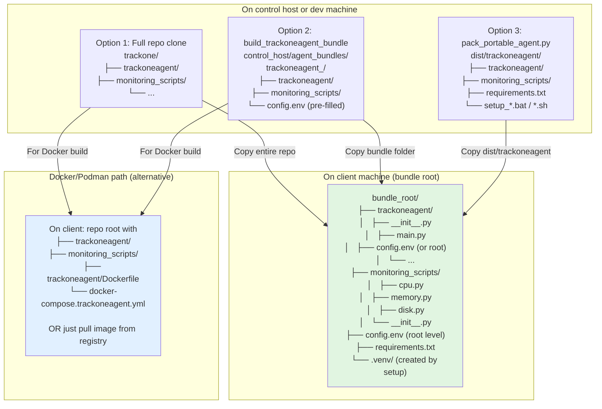
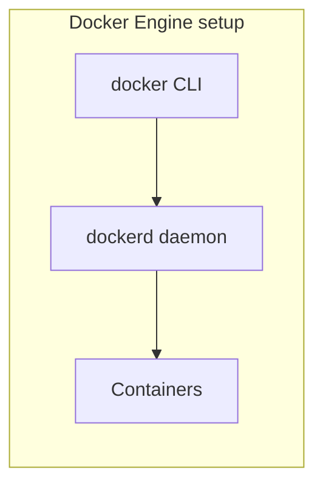
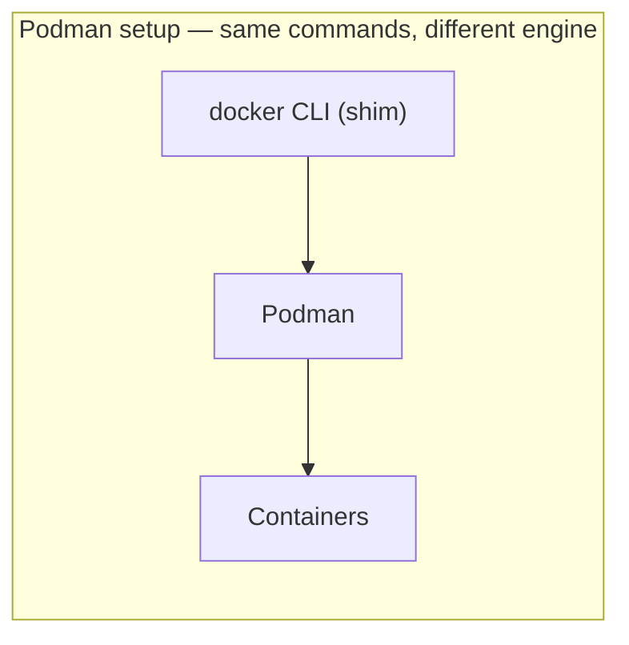
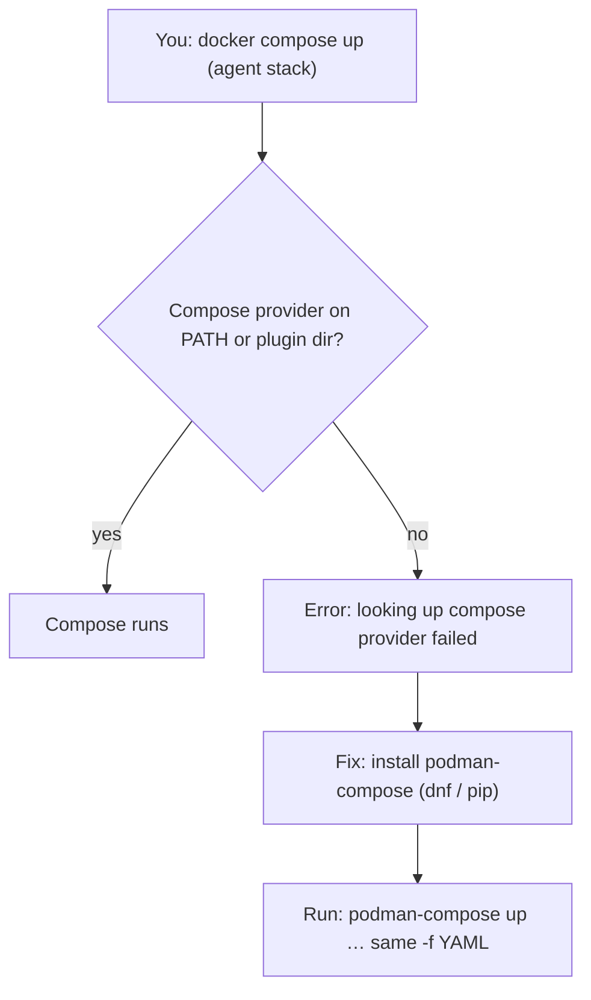
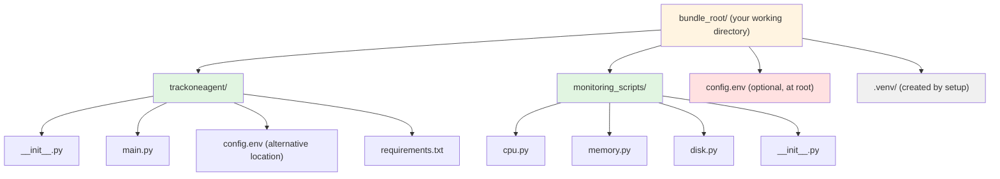

# TrackOne — control host + **trackoneagent** monitoring

Small monitoring stack: a **control host** (Django + PostgreSQL) receives periodic metric pushes from **trackoneagent** on client machines (Windows or Linux). Version one collects **CPU**, **memory**, and **disk** via shared modules under `monitoring_scripts/`.

## Plain-language guide (if you’re new to this)

**The story in one picture:** You have **one main computer** (the *control host*) that keeps a database of “how are my machines doing?” Each **client computer** runs **trackoneagent** (the TrackOne client). Every X seconds it measures CPU, RAM, and disks on *that* machine and sends the numbers over the network to the control host. So one server can watch many clients.

**What is Docker / Podman (here)?** This README assumes the **control host** uses **PostgreSQL installed on the server** (packages or your DBA standard)—**not** Postgres inside a container. **Docker** or **Podman** is optional **only on client machines** if you want to run **trackoneagent** from an image instead of a Python venv. The file **`docker-compose.trackoneagent.yml`** (plus **`trackoneagent/Dockerfile`**) describes that **agent** container. You need **Docker Desktop** (Windows/Mac), **Docker Engine**, or **Podman** *on each client where you choose the container path*—**not** on the control host for the database.

**Parts of this repo:**

| Idea | Simple meaning |
|------|----------------|
| `control_host/` | The **server app**: web API + admin website + talks to Postgres |
| `trackoneagent/` | The **TrackOne client program** you run on each machine you want to monitor |
| `monitoring_scripts/` | Shared **measuring tools** (CPU/RAM/disk) that **trackoneagent** calls |
| [Runbook: Linux control host](#runbook-control-host-on-linux-new-machine) | **Step-by-step** deploy on a new Linux server (PostgreSQL, `.env`, Python venv, migrate, `runserver`, firewall) |
| [Git troubleshooting (`pull`)](#git-divergent-branches-on-pull) | **Divergent branches** / **local changes would be overwritten by merge** — what they mean and how to fix |
| [Podman on RHEL / Oracle Linux](#podman-on-rhel-and-oracle-linux) | **`docker` = Podman**, **compose provider**, **subuid**, **cgroup / systemd / D-Bus** over SSH — agent-client notes |

**What the client machine needs installed** is spelled out in [trackoneagent — what to install on the client](#trackoneagent--what-to-install-on-the-client) below.

## Layout

| Path | Role |
|------|------|
| `monitoring_scripts/` | Collectors (`cpu`, `memory`, `disk`) used by **trackoneagent** |
| `control_host/` | Django project: REST-style ingest API + admin + Postgres storage |
| `trackoneagent/` | Long-running client package that samples on an interval and POSTs JSON |

## Scale (dozens of clients on one control host)

**Yes.** The model is agent-initiated HTTP POSTs on an interval (e.g. every 30s). Tens of hosts means on the order of tens of requests per interval spread over time—trivial for Django + PostgreSQL. Roughly: \(N\) hosts × (3600 / interval_seconds) ingests per hour; example: 50 hosts @ 30s ≈ 6k rows/hour into `MetricIngest`, which Postgres handles easily with the existing indexes.

**Production:** Use a real WSGI/ASGI server (e.g. Gunicorn/Uvicorn) behind a reverse proxy, not `runserver`. Over long periods, plan **retention** (prune or archive old `MetricIngest` rows) so the table does not grow without bound.

## Runbook: control host on Linux (new machine)

End-to-end steps for a **fresh Linux server** (SSH session, first-time install). For Windows nuances and deeper troubleshooting (including **connection refused** and **DisallowedHost**), see [Control host (Linux or Windows)](#control-host-linux-or-windows) — especially the **Troubleshooting** subsection near the end of that section.

### 0. Prerequisites

| Requirement | Why |
|-------------|-----|
| **Python 3.10+** | `control_host/requirements.txt` pins **Django 5.x**; older system Pythons cannot install it. Check: `python3 --version`. If too old, install a newer runtime (distro packages, [pyenv](https://github.com/pyenv/pyenv), or your org’s standard Python). |
| **PostgreSQL** | **Native** on the control host (distro packages or PGDG) or any **reachable** PostgreSQL instance — **not** covered here as a container on the control host. |
| **Network** | Agents need HTTP access to the control URL; open the app port in **firewalld** / **ufw** / cloud security groups if you connect from other machines. |

### 1. Get the code

```bash
git clone <YOUR_REPO_URL> trackone
cd trackone
```

### 2. PostgreSQL on the control host (native)

Install and run **PostgreSQL on the same Linux machine as Django** (or point `.env` at a remote Postgres your org provides). **Do not rely on Docker/Podman for the database** in this guide.

- **Debian / Ubuntu:** install `postgresql`, start the service (`sudo systemctl start postgresql`), then `sudo -u postgres psql` and run:

  ```sql
  CREATE USER trackone WITH PASSWORD 'choose_a_strong_password';
  CREATE DATABASE trackonedb OWNER trackone ENCODING 'UTF8';
  ```

  If the role already exists: `ALTER USER trackone WITH PASSWORD '…';`

- **RHEL 9 / Oracle Linux 9 with PostgreSQL from PGDG** (example: **PostgreSQL 17**, systemd unit **`postgresql-17`**):

  ```bash
  sudo /usr/pgsql-17/bin/postgresql-17-setup --initdb   # once, if the data directory is not initialized yet
  sudo systemctl enable --now postgresql-17
  sudo -u postgres /usr/pgsql-17/bin/psql -c "CREATE USER trackone WITH PASSWORD 'choose_a_strong_password';"
  sudo -u postgres /usr/pgsql-17/bin/psql -c "CREATE DATABASE trackonedb OWNER trackone ENCODING 'UTF8';"
  ```

  Adjust paths and service name if your major version differs (`postgresql-16`, etc.).

**Connection settings for Django:** same host as Postgres → `POSTGRES_HOST=localhost`, `POSTGRES_PORT=5432`. Remote database → set host/port and ensure `pg_hba.conf` and firewalls allow the app server.

### 3. Django environment (`.env`)

```bash
cd control_host
cp env.example .env
```

Edit **`.env`**:

- **`POSTGRES_PASSWORD`** — must match the **`trackone`** database password you set in PostgreSQL.
- **`DJANGO_ALLOWED_HOSTS`** — comma-separated; include every hostname or IP you use in the browser or from agents, e.g. `localhost,127.0.0.1,10.0.0.5,app.example.com`. Omitting this on a LAN IP often causes **DisallowedHost** after the connection works.
- **`DJANGO_DEBUG=1`** is fine for local dev; use **`DJANGO_DEBUG=0`** and a strong **`DJANGO_SECRET_KEY`** toward production.

Optional before building client bundles: **`TRACKONE_PUBLIC_BASE_URL`** (no trailing slash), e.g. `http://10.0.0.5:8000`, so `manage.py build_trackoneagent_bundle` embeds the correct control URL.

### 4. Virtualenv, dependencies, migrations

```bash
cd control_host    # directory that contains manage.py
python3 -m venv .venv
source .venv/bin/activate
python -m pip install --upgrade pip
pip install -r requirements.txt
python manage.py migrate
python manage.py createsuperuser
python manage.py create_monitored_host web-01
```

If **`pip install` fails on Django 5**, the venv’s Python is almost certainly **&lt; 3.10** — install a newer `python3`, remove `.venv`, and repeat this step.

Store the printed **API token** for **trackoneagent** on clients. For a one-step client folder with URL + token embedded:

```bash
# Optional in .env: TRACKONE_PUBLIC_BASE_URL=http://YOUR_SERVER:8000
python manage.py build_trackoneagent_bundle web-01 --control-url http://YOUR_SERVER:8000 --zip
```

### 5. Run the dev server (reachable from other hosts)

```bash
python manage.py runserver 0.0.0.0:8000
```

- **`0.0.0.0`** binds **all interfaces** so other machines can use **`http://<server-ip>:8000/`**. Default `runserver` alone often listens only on **127.0.0.1**, which looks like “connection refused” from the LAN.
- On the server itself, use **`http://127.0.0.1:8000/`** — do not use `http://0.0.0.0:8000/` in the browser (invalid on many clients).

**Useful URLs:** `GET /api/v1/health/`, admin at `/admin/`, charts at `/metrics/dashboard/` (after login).

### 6. Linux firewall (if LAN clients still cannot connect)

**Typical symptom:** `curl http://YOUR_SERVER_IP:PORT/api/v1/health/` on the **Linux host itself** returns JSON, but a **browser on another machine** shows **connection refused**, **timed out**, or the page never loads. Django is fine; **inbound TCP to `PORT` is blocked** (host firewall, cloud security group, or corporate network).

Open the **same TCP port** you passed to `runserver` (examples below use **8000** — replace with **8080** or whatever you use).

**firewalld** (RHEL / Oracle Linux / Fedora family):

```bash
sudo firewall-cmd --permanent --add-port=8000/tcp
sudo firewall-cmd --reload
```

Confirm: `sudo firewall-cmd --list-ports` (or `--list-all`) should list that port.

**ufw** (Debian/Ubuntu):

```bash
sudo ufw allow 8000/tcp
sudo ufw reload
```

Also allow the port in **cloud / hypervisor** security groups if the server runs in AWS, Azure, OCI, etc. For more causes (bind address, wrong port in the URL), see [Troubleshooting: “refused to connect”](#troubleshooting-refused-to-connect--phone-or-another-pc-cant-open-the-control-host) below.

### 7. Optional: admin UI via SSH (no public port)

From your laptop, forward local port 8000 to the server’s loopback:

```bash
ssh -L 8000:127.0.0.1:8000 user@linux-host
```

On the server run **`python manage.py runserver 127.0.0.1:8000`** (loopback only). Open **`http://127.0.0.1:8000/`** on the laptop while the session is open.

### 8. Production reminder

Do not expose **`runserver`** on the untrusted Internet. Use **Gunicorn** / **Uvicorn** behind **nginx** (or similar), TLS, and plan **metric retention** — see [Scale](#scale-dozens-of-clients-on-one-control-host).

### 9. Next: clients

Install or bundle **trackoneagent** on each monitored machine; see [trackoneagent (Windows or Linux)](#trackoneagent-windows-or-linux).

---

## Control host (Linux or Windows)

The control host is standard Django + PostgreSQL; **Windows works** the same way as Linux for development and many deployments.

**Oracle Linux VM (e.g. login `oracle@nyvm741`):** step-by-step install, **native** PostgreSQL, firewall, and `runserver 0.0.0.0:8000` — see **[docs/deploy-control-host-oracle-linux-vm.md](docs/deploy-control-host-oracle-linux-vm.md)**. (*“Oracle” here is the Linux user/OS; the app still uses **PostgreSQL**, not Oracle Database, unless you customize Django yourself.*) On Windows, install PostgreSQL natively (installer or your IT standard). Use a Windows venv (`python -m venv .venv` then `.\.venv\Scripts\Activate.ps1`). For production on Windows, use a Windows-friendly app server (e.g. **Waitress**) or run the app under **WSL2** if you prefer Linux-style Gunicorn/nginx.

1. **PostgreSQL (native on the control host)**

   **Install local PostgreSQL (already on this machine or install it first)**

   1. Make sure the **PostgreSQL service is running** (Windows: *Services* → *postgresql*…; Linux: `sudo systemctl status postgresql`).
   2. Open a shell as a superuser and create a database user and database. This project uses database name **`trackonedb`** and role **`trackone`** (change the password to something strong).

      Using **`psql`** (adjust `-U` if your superuser is not `postgres`):

      ```bash
      psql -U postgres
      ```

      Then run:

      ```sql
      CREATE USER trackone WITH PASSWORD 'choose_a_strong_password';
      CREATE DATABASE trackonedb OWNER trackone;
      ```

      `POSTGRES_DB` in your environment **must match** the database name (`trackonedb`). On some setups add `ENCODING 'UTF8'`. If the user already exists, use `ALTER USER trackone WITH PASSWORD '…';` instead of `CREATE USER`.

      Type `\q` to quit `psql`.

      In **pgAdmin**: *Login/Group Roles* → create role `trackone`; *Databases* → create database **`trackonedb`** owned by `trackone`.

      **Windows: `'psql' is not recognized'`** — PostgreSQL’s `bin` folder is often **not** on your PATH. You can:

      - Open **SQL Shell (psql)** from the Start menu (pick server, database, user, port; then run the same `CREATE USER` / `CREATE DATABASE` SQL as above), or  
      - Call `psql` by full path (replace `16` with your installed version — check under `C:\Program Files\PostgreSQL\`):

        ```cmd
        "C:\Program Files\PostgreSQL\16\bin\psql.exe" -U postgres
        ```

      - To fix it permanently: *Settings → System → About → Advanced system settings → Environment Variables* → edit **Path** (user or system) → **New** → `C:\Program Files\PostgreSQL\16\bin` → OK, then **open a new** terminal.

      You **do not** need `psql` in PATH for Django if the database and user already exist (e.g. you used **pgAdmin**); set `control_host/.env` and run `python manage.py migrate`.

   3. **Configure Django’s database connection** — easiest: create **`control_host/.env`** (same folder as `manage.py`). Copy `control_host/env.example` to `.env` and edit values. **`settings.py` loads `.env` automatically** via `python-dotenv` on startup. If a variable is missing from `.env`, the defaults in `settings.py` apply (`trackonedb` / `trackone` / `trackone` / `localhost` / `5432`)—set at least `POSTGRES_PASSWORD` if yours is not `trackone`.

      Alternatively set the same names in your shell or OS environment (they override `.env` if already set in the environment, depending on `load_dotenv` behavior — by default **existing OS env vars are not overwritten**).

      | Variable | Meaning | Typical local value |
      |----------|---------|----------------------|
      | `POSTGRES_DB` | Database name | `trackonedb` |
      | `POSTGRES_USER` | DB user | `trackone` |
      | `POSTGRES_PASSWORD` | DB user password | *(what you chose in SQL)* |
      | `POSTGRES_HOST` | Hostname | `localhost` |
      | `POSTGRES_PORT` | Port | `5432` |

      **Windows PowerShell (current window only):**

      ```powershell
      $env:POSTGRES_DB = "trackonedb"
      $env:POSTGRES_USER = "trackone"
      $env:POSTGRES_PASSWORD = "choose_a_strong_password"
      $env:POSTGRES_HOST = "localhost"
      $env:POSTGRES_PORT = "5432"
      ```

      **Windows Command Prompt (current window):**

      ```cmd
      set POSTGRES_DB=trackonedb
      set POSTGRES_USER=trackone
      set POSTGRES_PASSWORD=choose_a_strong_password
      set POSTGRES_HOST=localhost
      set POSTGRES_PORT=5432
      ```

      **Linux / macOS (current shell):**

      ```bash
      export POSTGRES_DB=trackonedb
      export POSTGRES_USER=trackone
      export POSTGRES_PASSWORD='choose_a_strong_password'
      export POSTGRES_HOST=localhost
      export POSTGRES_PORT=5432
      ```

      To make variables **persistent on Windows**, use *Settings → System → About → Advanced system settings → Environment variables* (user or system), or `setx POSTGRES_PASSWORD "..."` (note: `setx` does not affect the already-open terminal).

      See `control_host/env.example` for the full list (copy to `control_host/.env`). File `.env` is gitignored.

   4. **Check the connection** (optional): `psql -U trackone -d trackonedb -h localhost -c "SELECT 1;"` — enter the password when prompted. If this works, Django can use the same settings.

2. **Configure Django** — set as needed (in the same shell as above, or persistent env):

   - `DJANGO_SECRET_KEY` — required for production (any long random string).
   - `DJANGO_DEBUG=0` and `DJANGO_ALLOWED_HOSTS=your.hostname,127.0.0.1` in production.

3. **Install and migrate**

   ```bash
   cd control_host
   python -m venv .venv && source .venv/bin/activate  # Windows: .venv\Scripts\activate
   pip install -r requirements.txt
   python manage.py migrate
   python manage.py createsuperuser
   python manage.py create_monitored_host web-01
   ```

   Copy the printed token for **trackoneagent** on the client.

   **Or — one-step client folder (recommended):** register the host, embed URL + token, and copy the whole tree in one command (from `control_host/`):

   ```bash
   # Set in control_host/.env: TRACKONE_PUBLIC_BASE_URL=http://YOUR_SERVER_IP:8000
   python manage.py build_trackoneagent_bundle web-01
   # or pass URL explicitly:
   python manage.py build_trackoneagent_bundle web-01 --control-url http://192.168.1.50:8000 --zip
   ```

   This writes **`control_host/agent_bundles/trackoneagent_web-01/`** (gitignored) with `trackoneagent/`, `monitoring_scripts/`, scripts, and a **ready-made `config.env`**. Copy that folder (or the `.zip` with `--zip`) to the client. You still run **`setup_windows.bat` / `setup_linux.sh` once** there so a local `.venv` is created — that requires **Python on the client** (see below for true zero-install).

4. **Run**

   ```bash
   python manage.py runserver 0.0.0.0:8000
   ```

   **`0.0.0.0` means “listen on all interfaces”** — do **not** open `http://0.0.0.0:8000/` in a browser (you’ll get an invalid address error). Use **`http://localhost:8000/`** or **`http://127.0.0.1:8000/`** on the same machine; from another PC on the network use **`http://<this-machine-LAN-IP>:8000/`**.

   - **Home:** `GET /` — short page with links to the dashboard, admin, and API health (avoids a bare 404 on `http://localhost:8000/`).
   - Health: `GET /api/v1/health/`
   - Ingest: `POST /api/v1/ingest/` with `Authorization: Bearer <token>`
   - **Charts / history:** `GET /metrics/dashboard/` — line charts (CPU %, memory %, disk % over time). Sign in with your **Django admin** user (same account as `/admin/`). Pick a host, time range, or presets (1 h / 6 h / 24 h / 7 d). Data is read from stored ingests (`collected_at` on the horizontal axis).

   **Agent health on the dashboard:** Above the charts, an **Agent / connectivity** panel shows the **selected** monitored host, optional **hostname hint**, and **Last ingest received** (control-host server time). That timestamp updates on every **successful** `POST /api/v1/ingest/` from **trackoneagent**. **`Never`** means no ingest has succeeded yet (wrong token, URL, firewall, or agent not running). Below that, a **Disk usage by mount** table shows a **`df -h`‑style** snapshot (filesystem, size, used, avail, use %, mount point, fstype) from the **latest stored ingest** for that host—refresh the page after the agent runs to update it. Full history remains in each ingest’s JSON (**Admin → Metric ingests**). The line charts are **historical**: empty or flat lines in your chosen range usually mean no samples were stored in that window, even if **Last ingest** is recent—widen the time range or confirm the agent interval. For a tabular view of all hosts and tokens, use **Admin → Monitored hosts** (`last_seen_at` is the same field).

   Optional JSON for integrations (also requires an authenticated browser session or future API key):

   `GET /metrics/api/series/?host=<id>&from=<ISO8601>&to=<ISO8601>`

### Troubleshooting: “refused to connect” / phone or another PC can’t open the control host

**`ERR_CONNECTION_REFUSED`** or a **timeout** when opening `http://<server-ip>:<port>/` usually means the TCP connection never reached Django (wrong bind address, wrong port, process not running, or **firewall**). It is **not** a Django login or `ALLOWED_HOSTS` issue until you actually get an HTTP response (e.g. a Django error page).

**Quick pattern — Linux server, browser on your laptop:**  
If **`curl http://SERVER_IP:PORT/api/v1/health/`** on the **server SSH session** works but the **laptop browser** does not, the app is listening; **open inbound TCP `PORT` on the Linux firewall** (and any cloud security group). This is a very common “it works locally but not from my PC” fix.

Checklist (on the **control host** machine — the one running Django):

1. **Bind to all interfaces (or match your URL)**  
   Use **`python manage.py runserver 0.0.0.0:8000`** (replace **8000** with your port) so the server accepts connections on every interface.  
   Default `runserver` alone often listens only on **127.0.0.1**, so **only that PC** can connect via `localhost`; other devices get **connection refused** when they use the LAN IP.  
   If you bind to **one** address, e.g. **`runserver 10.16.99.197:8080`**, you must browse **`http://10.16.99.197:8080/`** — **`http://localhost:8080/`** on that same machine will **not** work (nothing is listening on `127.0.0.1` for that process).

2. **Confirm the server is running**  
   The terminal must show Django started; leave it open. Use the **exact** port from the `runserver` line (e.g. **8000** vs **8080**).

3. **Correct IP and port in the browser**  
   Use **`http://<IPv4>:<port>/`** — both must match `runserver`.  
   - **Windows:** `ipconfig` → **IPv4 Address** of the active adapter.  
   - **Linux:** `ip -br a` or `hostname -I`.  
   Sanity check from the server: `curl -sS http://127.0.0.1:PORT/api/v1/health/` and/or `curl -sS http://SERVER_IP:PORT/api/v1/health/`.

4. **Firewall — Windows**  
   Allow **inbound** TCP on the port you use (e.g. **8000**):  
   *Settings → Privacy & security → Windows Security → Firewall → Advanced settings → Inbound Rules → New Rule… → Port → TCP → Allow*.  
   Or allow **Python** / **python.exe** on private networks.  
   Only disable the firewall briefly on a trusted LAN to confirm the diagnosis, then re-enable and add a proper rule.

5. **Firewall — Linux (`firewalld`, common on RHEL / Oracle Linux)**  
   Replace **`PORT`** with your `runserver` port:

   ```bash
   sudo firewall-cmd --permanent --add-port=PORT/tcp
   sudo firewall-cmd --reload
   ```

   Verify: `sudo firewall-cmd --list-ports`. For **ufw** (Debian/Ubuntu): `sudo ufw allow PORT/tcp` and `sudo ufw reload`.  
   If the VM is in a cloud, add the same **inbound** rule in the provider’s **security group / NSG**.

6. **Same network / routing**  
   Phone and PC must reach the server’s IP (same LAN, VPN, or routed path). Guest Wi‑Fi often blocks device-to-device traffic.

After the page loads, if you see **DisallowedHost**, add the hostname or IP to **`DJANGO_ALLOWED_HOSTS`** in `control_host/.env` (e.g. `DJANGO_ALLOWED_HOSTS=localhost,127.0.0.1,10.16.99.197`) and restart `runserver`.

## trackoneagent (Windows or Linux)

### Can the client run with nothing installed?

**Not with the stock Python layout alone.** trackoneagent is Python code; something on the client must execute it:

| Approach | Client needs |
|----------|----------------|
| Normal / portable folder + `setup_*.bat` | **Python** once (creates `.venv` in the folder — no system-wide pip mess). |
| **`build_trackoneagent_bundle`** | Same: copy folder, run setup once; **no manual token/URL typing** — `config.env` is pre-filled. |
| **Docker / Podman** (below) | **Docker Engine**, **Docker Desktop**, or **Podman** (typical on RHEL / OL) with a **Compose** tool — **no Python or pip on the host** for the agent image. |
| Truly **no** Python *and* no Docker | Ship a **frozen `.exe`** (e.g. PyInstaller) or **embeddable Python** inside a folder. |

The control host command removes hand-editing of tokens and URLs; it does **not** remove the need for a Python runtime **unless** you use Docker (or a frozen binary).

### What to copy to the client machine

**Summary:** You need **two folders** side-by-side on the client: **`trackoneagent/`** and **`monitoring_scripts/`**. The parent folder (the **bundle root**) is where you run commands.



**Key points:**

- **Bundle root** = the folder that contains **both** `trackoneagent/` and `monitoring_scripts/` as **siblings** (same level).
- **`config.env`** can be at the **bundle root** OR inside `trackoneagent/` (root wins if both exist).
- **Docker path:** you still need the repo files **to build** the image (or pull a pre-built image from a registry).
- **`.venv/`** is created **on the client** by `setup_*.bat` / `setup_*.sh` or manually — **do not copy** a venv from another machine.

### Which machine do I use for Docker / Podman commands? (control host vs client)

| What you are doing | Run the command **on this machine** | Typical folder (current working directory) |
|--------------------|--------------------------------------|--------------------------------------------|
| **`docker build` / `docker compose` / `podman-compose` with `docker-compose.trackoneagent.yml`** (TrackOne **agent** image) | **Client** — each machine you want to **monitor** | **TrackOne repo root** on *that* client (must contain `trackoneagent/`, `monitoring_scripts/`, and the Dockerfile paths). *Alternatively:* build the image once on any PC, **`docker push`** to a registry, then on each client only **`docker pull`** + **`docker run`** (no full repo needed). |
| **Docker Desktop / Engine / Podman** | Install on **clients** that will run the **agent** in a container. The **control host** does **not** need containers for PostgreSQL in this guide — use **native Postgres** there. | — |

**Rule of thumb:** **PostgreSQL** runs **natively** on the **control host** (or is a managed DB elsewhere). **Docker / Podman** is only for **trackoneagent** on **client** machines that use the container path.

You would run the agent container **on the control host** only if you intentionally want that same server to appear as one monitored host — not required for a normal setup.

---

### Docker basics (if this is your first time)

**What Docker is (plain language)**  
Docker packages an app **and everything it needs to run** (here: a specific Python version and libraries) into a **single unit** you can copy between machines. You install **Docker** once on the computer; you do **not** install Python separately for the TrackOne agent if you use our image.

Think of it like a **self-contained lunchbox**: the recipe is the **Dockerfile**, the packed lunch is the **image**, and when you “open and eat” it on a machine, that running instance is a **container**.

| Term | Meaning |
|------|--------|
| **Dockerfile** | A text recipe: “start from this base OS, copy these files, run this command.” Our **`trackoneagent/Dockerfile`** describes how to build the agent image. |
| **Image** | A **read-only template** built from a Dockerfile (like a snapshot). Named with a tag, e.g. `trackone-agent:latest`. |
| **Container** | A **running** (or stopped) instance of an image. You can run many containers from one image. |
| **Registry** | A place that **stores images** (e.g. Docker Hub, GitHub Container Registry). You `docker push` after build, others `docker pull`. |
| **Docker Compose** | A tool that reads a **YAML file**. For TrackOne, **`docker-compose.trackoneagent.yml`** builds and starts the **agent** container. (A root **`docker-compose.yml`** file may exist in the repo for other experiments; **this README assumes native PostgreSQL** on the control host, not Postgres in Docker.) |

**Install Docker**

- **Windows / Mac:** install **[Docker Desktop](https://www.docker.com/products/docker-desktop/)** (it includes the `docker` and `docker compose` commands). After install, reboot if asked; ensure Docker Desktop is **running** (whale icon in the tray).
- **Linux:** install **Docker Engine** from your distribution’s docs (e.g. Ubuntu: Docker’s official “Install Docker Engine” page). On **RHEL / Oracle Linux / Rocky**, **Podman** is common; the `docker` command may be a **compatibility shim** — see [Podman on RHEL / Oracle Linux](#podman-on-rhel-and-oracle-linux).

Open a terminal (PowerShell, cmd, or bash) and check:

```bash
docker version
docker compose version
```

**Common commands you’ll use**

```bash
# Build an image from a Dockerfile (last argument "." = build context folder, usually repo root)
docker build -f trackoneagent/Dockerfile -t trackone-agent:latest .

# Run a container in the background (-d), set env vars (-e), name it (--name)
docker run -d --name trackone-agent -e SOME_VAR=value trackone-agent:latest

# List running containers
docker ps

# Follow logs (Ctrl+C stops following, not the container)
docker logs -f trackone-agent

# Stop and remove a container
docker stop trackone-agent
docker rm trackone-agent
```

**Compose (TrackOne agent — run on the client)**

These examples assume your terminal’s current directory is the **TrackOne repo root on the client** (same level as `trackoneagent/` and `monitoring_scripts/`).

```bash
# Build (if needed) and start in background; --build rebuilds the image
docker compose -f docker-compose.trackoneagent.yml --env-file agent.docker.env up -d --build

# See logs
docker compose -f docker-compose.trackoneagent.yml logs -f

# Stop and remove containers defined in that file
docker compose -f docker-compose.trackoneagent.yml down
```

### Podman on RHEL and Oracle Linux

On many **Red Hat–family** servers, **`docker`** is not Docker Engine — it runs **Podman** and may print:

```text
Emulate Docker CLI using podman. Create /etc/containers/nodocker to quiet msg.
```

That is **normal**. To hide only that notice (optional):  
`sudo touch /etc/containers/nodocker`

#### Diagrams — how this differs from “real” Docker

**Typical Docker Engine (Docker Desktop, many Ubuntu installs):** one CLI talks to a **daemon** that runs containers.



**Many RHEL / Oracle Linux hosts:** the **`docker`** command is a **compatibility shim**; **Podman** runs containers (often **rootless**, no `dockerd`).



**Why `docker compose` breaks but `docker run` often works:** the shim must find a **Compose implementation**. If none is installed, you install **`podman-compose`** and call it by name.



**Guidelines**

| Topic | What to know |
|--------|----------------|
| **Images / runs** | Most **`docker build`**, **`docker run`**, **`docker ps`** usage maps to **Podman** the same way when the shim is installed. |
| **`docker compose` fails** | Podman’s shim looks for a **Compose provider** (`docker-compose` binary, a CLI plugin, or **`podman-compose`**). If you see **“looking up compose provider failed”**, install **`podman-compose`** and call it explicitly (hyphenated name). |
| **Install `podman-compose`** | Try **`sudo dnf install podman-compose`** (or **`yum`**). If the package is missing, enable **EPEL** on RHEL 8–style systems, then install again. Alternative: **`python3 -m pip install --user podman-compose`** and ensure **`~/.local/bin`** is on **`PATH`**. |

From the **TrackOne repo root** on a **client**, use the same **`-f`** / **`--env-file`** flags as in the **`docker compose`** examples, but run **`podman-compose`** (hyphenated):

```bash
# TrackOne agent (client machine)
podman-compose -f docker-compose.trackoneagent.yml --env-file agent.docker.env up -d --build
```

| Topic | What to know |
|--------|----------------|
| **Rootless / `subuid`** | If **`docker version`** or **`podman info`** reports **no subuid ranges** for your user (common for service accounts like **`oracle`**), **rootless** containers may fail or warn. A **Linux admin** should assign non-overlapping ranges in **`/etc/subuid`** and **`/etc/subgid`** (see **`man subuid`** / your OS hardening guide). Until then, prefer **venv + Python** for the agent, or **rootful** Podman only if your policy allows it. |
| **Locked-down hosts** | If container tooling is blocked or brittle on **database servers**, use the **non-Docker** trackoneagent path (**venv** + Python **3.10+** alongside system Python). |

#### Agent client: Podman warnings (cgroup, systemd, D-Bus, SSH)

These messages often appear on **RHEL 9 / Oracle Linux 9** (and similar) when you run **`docker`** / **`podman`** as a **non-root** user over **SSH**, under **Ansible**, or without a full **systemd user session** (no graphical login, no “lingering” user session).

**1. `The cgroupv2 manager is set to systemd but there is no systemd user session available`**

Podman is trying to use **systemd** to manage **cgroups** for rootless containers, but your login has **no active user `@session`** (common for bare SSH or automation accounts).

| What to do | Who runs it | Notes |
|------------|-------------|--------|
| **`sudo loginctl enable-linger <username>`** | root | Lets your user keep a **systemd user session** even when not logged in (replace `<username>` with e.g. **`ansibleuser`**). Podman’s suggested line **`loginctl enable-linger 1001`** uses the **numeric UID** — only use that if it matches **`id -u`** for that user. After enabling, **log out and SSH back in** (or reboot) and retry **`docker version`**. |
| **Ignore if things still work** | — | The next line **`Falling back to --cgroup-manager=cgroupfs`** means Podman continues with a different cgroup driver; many **trackoneagent** images run fine. |
| **Force cgroupfs** (optional) | user | To prefer **cgroupfs** without enabling lingering, create or edit **`~/.config/containers/containers.conf`** (rootless user override) and set under **`[engine]`**: **`cgroup_manager = "cgroupfs"`** (see **`man containers.conf`** on your OS). |

**2. `Failed to add pause process to systemd sandbox cgroup: dbus: couldn't determine address of session bus`**

Usually the **same situation**: rootless Podman expects a **user D-Bus** / **systemd --user** session. **`loginctl enable-linger`** (above) typically fixes it. Also ensure you are not stripping **`XDG_RUNTIME_DIR`** in SSH/Ansible; over SSH it should normally be set (e.g. **`/run/user/<uid>`**).

**3. `Error: looking up compose provider failed` (and `podman-compose` not found)**

Unrelated to cgroups: you still need a **Compose** implementation. Install **`podman-compose`** and use the **`podman-compose`** command for **`docker-compose.trackoneagent.yml`** (see the table above). Example: **`sudo dnf install podman-compose`** on EL9, or **`python3 -m pip install --user podman-compose`** and add **`~/.local/bin`** to **`PATH`**.

**Quick checklist (trackoneagent on a Podman client)**

1. **`id -u`** — note UID if an admin will run **`loginctl enable-linger`**.  
2. Prefer **`loginctl enable-linger <your_login_name>`** once (as root) for service-style users (**`ansibleuser`**, deploy accounts, etc.).  
3. Install **`podman-compose`**; use **`podman-compose -f docker-compose.trackoneagent.yml …`** instead of **`docker compose`**.  
4. If **`docker version`** still warns but **`podman run`** / **`podman-compose up`** succeeds, you can treat warnings as **non-fatal** unless something actually fails.

**Why not `http://localhost:8000` inside the container?**  
Inside a container, **`localhost` means “this container,”** not your PC. To reach the TrackOne **control host** on another machine, use that machine’s **IP or hostname**. If the control host runs **on the same Windows/Mac as Docker Desktop**, try **`http://host.docker.internal:8000`** so the container can reach the host.

---

### Docker on the client (recommended: “only start the agent”)

**Where:** run every command in this subsection on **each client machine** (unless you only **build** the image on a build server, then **pull/run** on clients).

The repo includes **`trackoneagent/Dockerfile`** and **`docker-compose.trackoneagent.yml`**. The image bundles Python, `psutil`, `requests`, and the agent code — you only configure URL/token and start the container.

1. On the **client**, with **Docker** or **Podman** installed, open a terminal in the **TrackOne repository root** (needs `trackoneagent/`, `monitoring_scripts/`, Dockerfile paths):

   ```bash
   cp trackoneagent/docker.env.example agent.docker.env
   # Edit agent.docker.env: TRACKONE_CONTROL_URL, TRACKONE_API_TOKEN
   docker compose -f docker-compose.trackoneagent.yml --env-file agent.docker.env up -d --build
   ```

   On **Podman-only** hosts where **`docker compose`** fails, use **`podman-compose`** with the same **`-f`** and **`--env-file`** (see [Podman on RHEL and Oracle Linux](#podman-on-rhel-and-oracle-linux)).

   If **`docker version`** prints **cgroup / systemd / D-Bus session** warnings (typical over **SSH** for users like **`ansibleuser`**), see **[Agent client: Podman warnings](#agent-client-podman-warnings-cgroup-systemd-d-bus-ssh)** — often **`sudo loginctl enable-linger <username>`** (as root) plus installing **`podman-compose`** fixes the experience.

2. Or **build once** (on the **client** or on a **build PC**), then run the image on **each client**:

   ```bash
   docker build -f trackoneagent/Dockerfile -t trackone-agent:latest .
   docker run -d --name trackone-agent --restart unless-stopped \
     -e TRACKONE_CONTROL_URL=http://YOUR_CONTROL_HOST:8000 \
     -e TRACKONE_API_TOKEN=your_token \
     trackone-agent:latest
   ```

3. **Publish** `trackone-agent:latest` to your registry; on clients with only Docker: `docker pull …` then `docker run …` (no repo clone, no build). Put URL/token in `-e` or an env file.

**Reachability:** From a container, `localhost` is the container itself. Use the control host’s **LAN IP** or **Docker host gateway** (e.g. `http://host.docker.internal:8000` on Docker Desktop for Windows/Mac when the control host runs on the same PC).

**Metrics scope:** By default, CPU/RAM/disk reflect the **container**. On **Linux**, you can add `pid: host` under the service in `docker-compose.trackoneagent.yml` (uncomment) to see **host** processes — optional; understand the security implications before using it on untrusted hosts.

---

The client package directory is **`trackoneagent/`** (replacing the old `agent/` name). If you still have `agent/config.env`, copy it to **`trackoneagent/config.env`** or to the bundle-root **`config.env`**.

### Non-Docker: install and verify trackoneagent (step by step)

**Where:** all steps below run on the **client** (the machine you want to monitor), unless noted.

**What you do *not* need on the client:** Docker, PostgreSQL, Django — only **Python 3.10+** and network access to the control host.

#### Before you start (control host)

1. Control host API is reachable from this client. Quick check from the **client** browser or `curl`:

   `http://<CONTROL_HOST>:<PORT>/api/v1/health/`  
   You should see JSON like `{"ok": true, "service": "trackone-control"}`.

2. You have a **MonitoredHost** and **API token** from the control host, using **one** of:

   - `cd control_host && python manage.py create_monitored_host my-pc-01` — copy the printed token; or  
   - `python manage.py build_trackoneagent_bundle my-pc-01 --control-url http://...` — copy the generated folder; **`config.env` inside is already filled** (skip manual config in Step 4 if you use only that file at bundle root).

---

#### Step 1 — Install Python (3.10+; use 3.11 if you prefer)

**Detailed guide (Windows + Oracle Linux 3.11):** **[docs/install-python-311-client.md](docs/install-python-311-client.md)**

- **Windows (3.11):** download the **Windows installer** from [Python 3.11 releases](https://www.python.org/downloads/release/python-3119/) (or latest 3.11.x), enable **“Add python.exe to PATH”**, install. Optional: `winget install Python.Python.3.11`.  
- **Oracle Linux 9 (client):** `sudo dnf install -y python3.11 python3.11-pip python3.11-devel` — use **`python3.11`** for the venv: `python3.11 -m venv .venv` (default `python3` may still be 3.9).  
- **Oracle Linux 8:** run `dnf search python3.11`; if unavailable, use any **Python ≥ 3.10** from your repos or see the doc above.  
- **Debian / Ubuntu:** e.g. `sudo apt install python3 python3-venv python3-pip`.

**Verify:**

```bash
python --version
# or on OEL: python3.11 --version
```

Use **`python3`** / **`python3.11`** on Linux if `python` is not available. You want **3.10 or newer**.

---

#### Step 2 — Put the TrackOne folders on this machine

You need a **parent folder** (call it the **bundle root**) that contains **both**:

- `trackoneagent/`
- `monitoring_scripts/`

**Required structure on the client:**



**Ways to get that layout:**

- Clone this repository on the client; the bundle root is the repo root (`trackone/`).  
- Or copy **`dist/trackoneagent/`** from `python scripts/pack_portable_agent.py` on another machine.  
- Or copy **`control_host/agent_bundles/trackoneagent_<name>/`** from `build_trackoneagent_bundle`.

**Verify:** open the bundle root in a file explorer or `ls` — you must see `trackoneagent` and `monitoring_scripts` as **siblings** (same level).

---

#### Step 3 — Virtual environment and dependencies

Open a terminal and **`cd` to the bundle root** (the folder from Step 2).

**Windows (PowerShell):**

```powershell
cd C:\path\to\trackone
python -m venv .venv
.\.venv\Scripts\Activate.ps1
python -m pip install --upgrade pip
pip install -r trackoneagent\requirements.txt
```

**Linux / macOS:**

```bash
cd /path/to/trackone
python3 -m venv .venv
source .venv/bin/activate
python -m pip install --upgrade pip
pip install -r trackoneagent/requirements.txt
```

**Verify libraries:**

```bash
pip show psutil requests
python -c "import psutil, requests; print('imports ok')"
```

If this fails, fix `pip install` errors before continuing.

---

#### Step 4 — Configuration (`TRACKONE_CONTROL_URL` + token)

**trackoneagent** reads, in order: environment variables (if already set), then **`config.env` in the bundle root**, then **`trackoneagent/config.env`**. Values in the environment win over files.

If you **do not** already have a root `config.env` from `build_trackoneagent_bundle`:

```bash
cp trackoneagent/config.example.env config.env
```

Edit **`config.env`** (at bundle root) or **`trackoneagent/config.env`**:

```env
TRACKONE_CONTROL_URL=http://192.168.1.50:8000
TRACKONE_API_TOKEN=paste_token_from_create_monitored_host
TRACKONE_INTERVAL_SECONDS=30
```

- **No trailing slash** on the URL.  
- **Exactly one scheme:** use `http://10.16.99.197:8080` — **not** `http://http://10.16.99.197:8080` (a duplicated `http://` often happens if you paste a full URL next to a template that already had `http://`). That broken form makes `agent_check` show **`host=http`** in the URL-parse step and **TCP connect** fails with **Name or service not known**. Current **trackoneagent** versions **auto-correct** a duplicated `http://` or `https://` when possible; fixing **`config.env`** is still best.
- Use the control host’s **IP or hostname** as seen **from this client** (e.g. agent on **NYVM737** → control **`10.16.99.197:8080`**, not `localhost` unless Django runs on the same box).  
- **Firewall / routing:** the **agent host** must allow **outbound** TCP to the control host’s **port** (e.g. **8080**), and the network must route to **`10.16.99.197`**.

---

#### Step 5 — Verify connectivity and collectors (before long-running agent)

With the **venv still activated** and **`cd` = bundle root** (the folder that contains **`trackoneagent/`** and **`monitoring_scripts/`** — **not** inside **`trackoneagent/`** itself):

```bash
python -m trackoneagent.agent_check
```

For a first install (no background agent yet), you can add:

```bash
python -m trackoneagent.agent_check --skip-pidfile
```

**What success looks like:** each line shows `[OK ]`, ending with `Summary: all checks passed.`

**If something fails**, read the block under that step — it names the failing check (config, local metrics, TCP, HTTP health, HTTP ingest). Fix that layer (wrong URL, wrong token, firewall, control host down) and run `agent_check` again.

**Common mistakes**

| Symptom | Cause | Fix |
|--------|--------|-----|
| **`ModuleNotFoundError: No module named 'trackoneagent'`** | You ran **`python -m trackoneagent.agent_check`** from inside the **`trackoneagent/`** subdirectory. | **`cd`** to the **bundle root** (parent of **`trackoneagent/`**), activate **`.venv`**, run the same command again. |
| **URL line shows `http://http://...`** or **URL parse** shows **`host=http`** | **`TRACKONE_CONTROL_URL`** has a **double** `http://` (or `https://`) in **`config.env`**. | Edit **`config.env`**: one scheme only, e.g. **`TRACKONE_CONTROL_URL=http://10.16.99.197:8080`**. |
| **TCP connect … Name or service not known** | Often the **double-`http://`** bug (hostname becomes the literal string **`http`**). Less often: wrong hostname, DNS, or no route to the control IP. | Fix URL; from the agent host run **`curl -sS http://10.16.99.197:8080/api/v1/health/`** (adjust IP/port). |

---

#### Step 6 — Run trackoneagent

Still **bundle root**, **venv active**:

```bash
python -m trackoneagent
```

You should see log lines such as `Ingest ok` every interval. **Ctrl+C** stops the agent.

**Optional — background / log file:** set `TRACKONE_PIDFILE` and `TRACKONE_LOGFILE` (see portable scripts below), or use `start_agent_background.bat` / `.sh` from a portable bundle.

---

#### Step 7 — Verify on the control host

On the **control host** (browser, logged into Django admin):

1. **Monitored hosts** — the row for this host should show **last_seen_at** updating.  
2. **Metric ingests** — new rows appearing on the expected interval.  
3. Optional: **`/metrics/dashboard/`** — **Agent / connectivity** shows **Last ingest received** for the selected host; charts appear after enough samples in the chosen time range.

If Step 5 passed but Step 7 does not update, confirm the token matches the **same** `MonitoredHost` name you registered and that the agent is still running on the client.

**Config reference:** you can set `TRACKONE_CONTROL_URL` / `TRACKONE_API_TOKEN` in the OS environment instead of files (they override file values). Optional: `TRACKONE_PIDFILE` (e.g. `agent.pid`), `TRACKONE_LOGFILE` (log file path for background runs), `TRACKONE_CONFIG` (path to a specific env file).

---

### Portable folder (copy to client) + background + `agent_check`

To ship a **self-contained directory** (no full Git repo on the client):

1. On your dev machine, from the **repo root**:

   ```bash
   python scripts/pack_portable_agent.py
   ```

   This creates **`dist/trackoneagent/`** with `trackoneagent/`, `monitoring_scripts/`, `requirements.txt`, `config.example.env`, and helper scripts.

2. Copy **`dist/trackoneagent`** to the client (USB, zip, etc.).

3. **Windows:** run `setup_windows.bat` (creates `.venv`, installs deps, copies `config.example.env` → `config.env` if missing). Edit `config.env`.  
   **Linux:** `chmod +x *.sh && ./setup_linux.sh`, then edit `config.env`.

4. **Diagnostics** (shows each step and what failed):

   - Windows: `run_agent_check.bat`
   - Linux: `./run_agent_check.sh`
   - Or from the bundle folder: `.venv\Scripts\python -m trackoneagent.agent_check` (Windows) / `.venv/bin/python -m trackoneagent.agent_check` (Linux)

   Checks include: config present, **local** CPU/memory/disk collection, URL parse, **TCP** to control host, **GET** `/api/v1/health/`, **POST** `/api/v1/ingest/` with a real payload, and (if `agent.pid` exists) whether that process is still running.

5. **Run in background**

   - Windows: `start_agent_background.bat` — uses `pythonw` (no console), writes **`agent.pid`** and **`agent.log`** in the bundle folder.
   - Linux: `./start_agent_background.sh` — `nohup`, same pid/log files.

6. **Stop:** `stop_agent.bat` or `./stop_agent.sh` (uses `agent.pid`).

For a custom output path: `python scripts/pack_portable_agent.py --out D:\deploy\trackoneagent`.

### Payload technical shape (optional)

Each POST body:

```json
{
  "hostname": "client-hostname",
  "timestamp": "2026-03-19T12:00:00.000000Z",
  "metrics": {
    "cpu": { "percent": 12.3, ... },
    "memory": { "virtual": { ... }, "swap": { ... } },
    "disk": {
      "partitions": [
        {
          "device": "/dev/sda1",
          "mountpoint": "/",
          "fstype": "ext4",
          "total_bytes": 107374182400,
          "used_bytes": 53687091200,
          "free_bytes": 53687091200,
          "percent": 50.0,
          "size_h": "100G",
          "used_h": "50G",
          "avail_h": "50G",
          "use_pcent": "50%"
        }
      ]
    }
  }
}
```

Each ingest stores **all mount points** the agent could read (similar scope to **`df -h`**, via `psutil.disk_partitions(all=True)`; unreadable mounts are skipped). Rows appear in Django admin as **Metric ingests**; **Monitored hosts** shows `last_seen_at` after each successful push.

## Adding more metrics later

Add a new module under `monitoring_scripts/` (e.g. `network.py` with `collect_network()`), export it from `monitoring_scripts/__init__.py`, and extend `collect_payload()` in `trackoneagent/main.py`. The control host stores the full `metrics` object as JSON, so no schema migration is required for new keys.

## Git: divergent branches on `pull`

### What the error means

When you run `git pull origin main` (or `git pull --tags origin main`), Git **fetches** new commits from GitHub, then must **combine** them with your local `main`.

**Divergent branches** means:

- **GitHub’s `main`** has commit(s) you do **not** have locally (someone else pushed, or you pushed from another machine), **and**
- **Your local `main`** has commit(s) that are **not** on GitHub (e.g. README edits, deploy notes, commits you never pushed).

So the histories **forked**. A simple **fast-forward** is impossible: Git has to either **merge** the two lines of history or **rebase** your work on top of the remote.

Recent Git versions **refuse to guess**: they exit with **`fatal: Need to specify how to reconcile divergent branches`** until you pick a strategy (once per repo via config, or per command with flags).

### What you can do

Pick **one** approach and stick to it for this clone (or set it **globally** with `git config --global …`).

| Approach | Command (one-time pull) | Effect |
|----------|-------------------------|--------|
| **Merge** (default style on many teams) | `git pull --no-rebase origin main` | Creates a **merge commit** joining remote and local `main`. Safe and obvious in history. |
| **Rebase** (linear history) | `git pull --rebase origin main` | Replays **your** local commits **on top of** `origin/main`. No merge commit; rewrites local commit hashes (fine if you haven’t shared those commits elsewhere). |
| **Fast-forward only** | `git pull --ff-only origin main` | **Succeeds only** if your branch can move forward without merging. **Fails** when branches diverged — use when you want to force yourself to rebase/merge manually. |

To **set a default** for this repository so plain `git pull` works:

```bash
git config pull.rebase false   # merge when pulling (common default)
# or
git config pull.rebase true    # rebase when pulling
# or
git config pull.ff only        # only fast-forward; otherwise error until you merge/rebase yourself
```

After resolving, run `git push origin main` when you are ready to publish your side.

### If you are unsure

Use **`git pull --no-rebase origin main`**, fix any merge conflicts if Git reports them, then commit and push. That matches how many projects expect contributors to integrate `main`.

### “Local changes would be overwritten by merge”

Example:

```text
error: Your local changes to the following files would be overwritten by merge:
        README.md
Please commit your changes or stash them before you merge.
```

**Meaning:** You have **uncommitted edits** in your working tree (here `README.md`). The incoming merge would change that file; Git refuses to overwrite your edits without you saving them somewhere first.

**Fix — keep your edits:** from the **repository root** (the folder that contains `.git` and `README.md`, not only `control_host/`):

```bash
git add README.md
git commit -m "Describe your README change"
git pull --no-rebase origin main
```

**Fix — shelve edits, pull, then re-apply:**

```bash
git stash push -m "wip" -- README.md
git pull --no-rebase origin main
git stash pop
```

(Then resolve conflicts if `stash pop` reports any, and commit.)

**Fix — discard local changes to that file** (only if you do not need them):

```bash
git restore README.md
git pull --no-rebase origin main
```

### See also

- Official docs: [git pull](https://git-scm.com/docs/git-pull) and [branching workflows](https://git-scm.com/book/en/v2/Git-Branching-Branching-Workflows).
